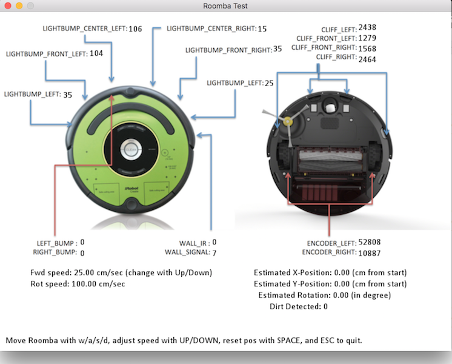

# Python Roomba
Python 2.7 scripts to control the Roomba via serial cable. This work is based on the script from [this](http://cs.gmu.edu/~zduric/cs101/pmwiki.php/Main/APITutorial) course. I adjusted it a bit to get access to the light bump in the Create 2 and my Roomba 770.

### Dependencies
You need pyserial to run this script.

    pip install pyserial
    
or
    
    easy_install pyserial

### Tester
I added a file to control the roomba with the wasd-keys. For that you also need pygame installed.
Just run 

    python game.py
    
and a window with some information about the current sensor values like the one below:

Move the Roomba around with w/a/s/d.

### Use as library

The main class is create.py which contains everything to talk to the Roomba. To use it write sth like:

    import create
    import time
    robot = create.Create(ROOMBA_PORT)
    robot.printSensors() # debug output
    wall_fun = robot.senseFunc(create.WALL_SIGNAL) # get a callback for a sensor.
    print (wall_fun()) # print a sensor value.
    robot.toSafeMode()
    robot.go(0,100) # spin
    time.sleep(2.0)
    robot.close()

For more information read the original [tutorial](http://cs.gmu.edu/~zduric/cs101/pmwiki.php/Main/APITutorial). The list of all available sensors is [here](https://github.com/martinschaef/roomba/blob/master/create.py#L70).

### My setup

I tested these scripts using this [cable](http://store.irobot.com/communication-cable-create-2/product.jsp?productId=54235746) and a Roomba 770. I tested the code on a Mac and on a RaspberryPi with debian (you need to change the PORT to tty.USB0 on the Pi) If the Roomba does not connect properly, check the cable first, then check if the port is correct, and then check if the baud rate in create.py is correct.

### Known issues

The odometer data is nonsense. I assume that there are bugs in the computation because its off way too much to count it as cumulative error.
